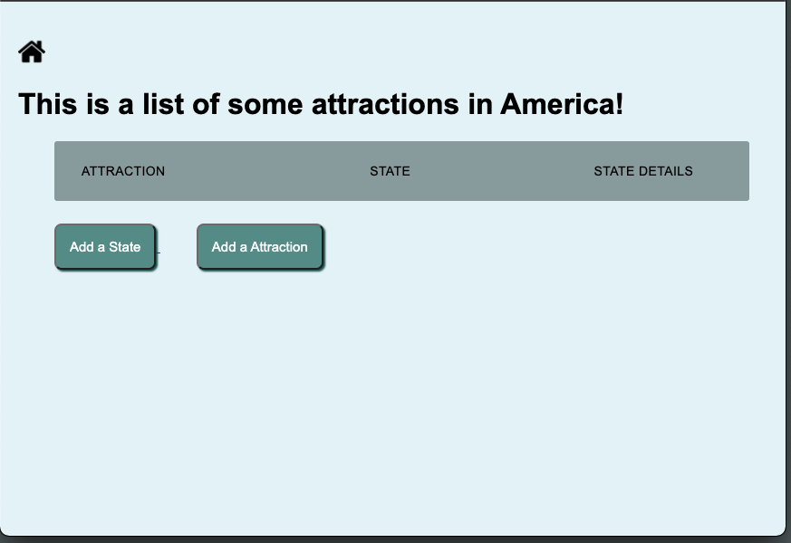
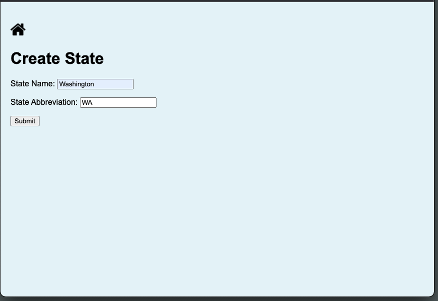
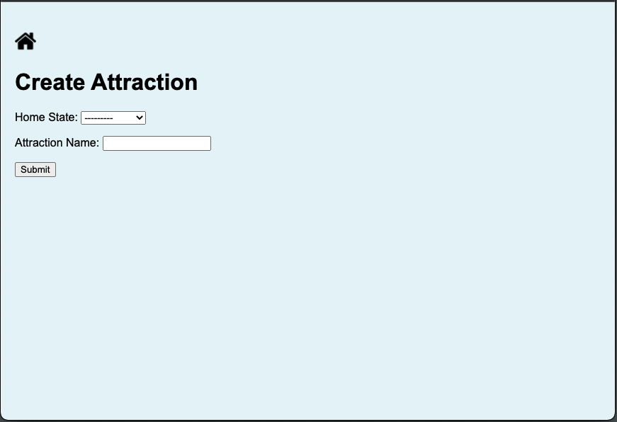
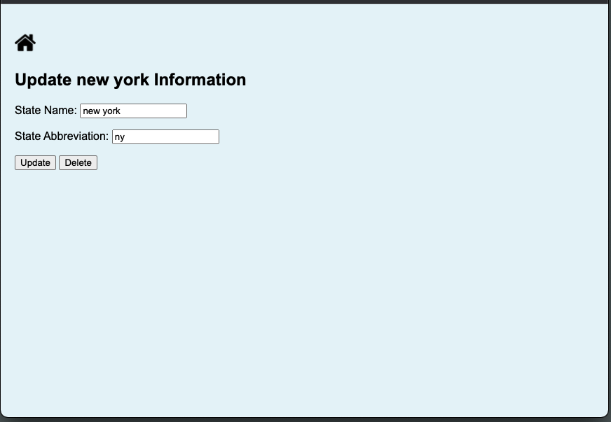
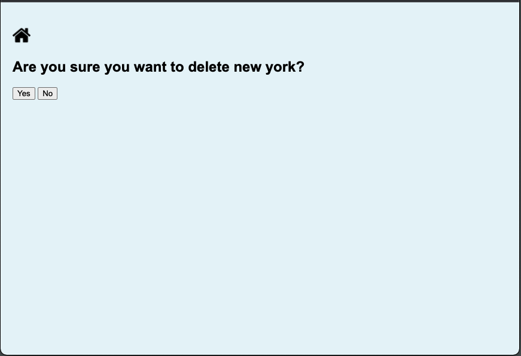
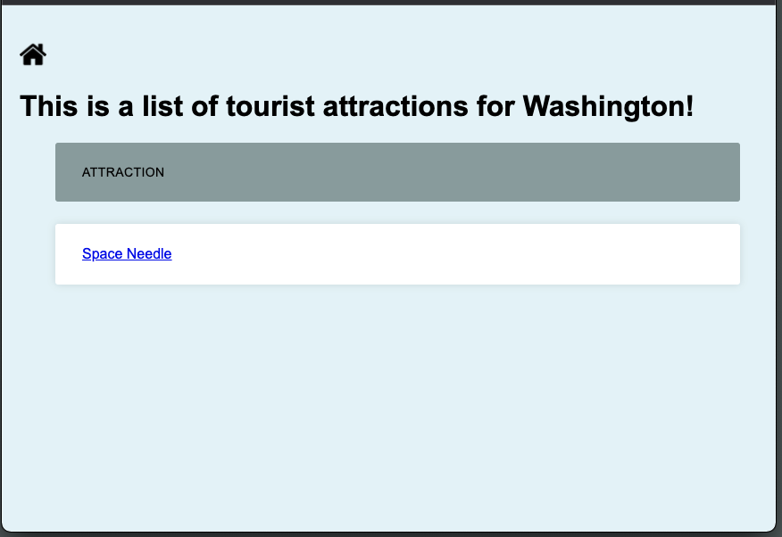

# Tourist Attraction with Forms - Django Project

Trouist Attraction web app is built to help the local travel agency to keep up with all the new attractions being added all over country. You can add, update, delete and view attractions to the list. 

## Requirement

This app requires Django. Please check "requirement.txt" for other required packages.

## Skills Used in Project
<ul>
    <li>Django
        <ul>
            <li>HTML template</li>
            <li>Modeling</li>
            <li>Interaing with database</li>
            <li>Generic form creation</li>
            <li>Using forms to create instances</li>
            <li>Form security</li>
        </ul>
    </li>
    <li>Python</li>
    <li>HTML</li>
    <li>CSS</li>
</ul>

## How to Use This App

### Home Page

### Create State
Click on "Add State" button to start creating a state, and fill out the form.

### Create Attraction
Click on "Add Attraction" button to start creating an attraction, and fill out the form.

### Update State/Attraction
Click on hyper link on the state or attraction that you would like to update, and hit "Update" button.

### Delete State/Attraciton
Click on hyper linke of the state of attraction that you would like to delete, and hit "Delete" button.

### See Details of State
Click on hyper link "State Details" to view the list of attraction of desired state.
